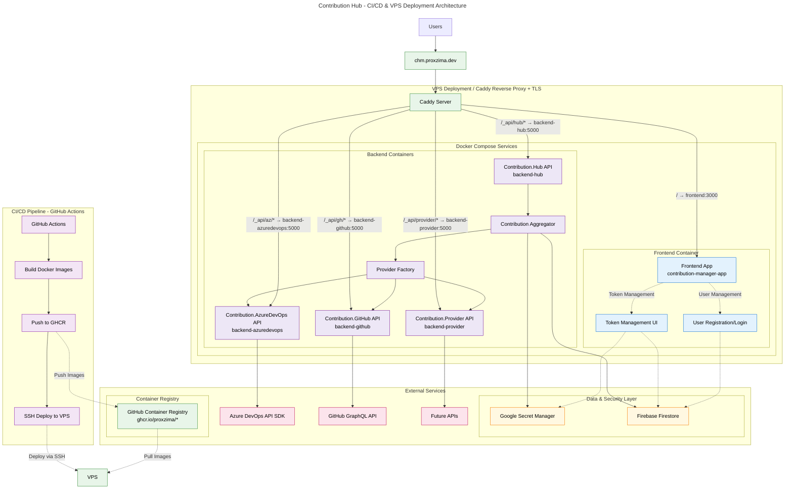

<a id="readme-top"></a>

<div align="center">
  
  <h3>Contribution Hub Manager</h3>
  <p>
    <strong>A secure web interface for managing developer credentials and accessing unified contribution data</strong>
  </p>

  <!-- Badges -->
  <p>
    <a href="https://github.com/PROxZIMA/ContributionManager/actions/workflows/Contribution.Manager.VPS.yaml">
      
    </a>
    <a href="LICENSE">
      
    </a>
  </p>
</div>

## Table of Contents

- [About The Project](#about-the-project)
- [Architecture](#architecture)
- [Getting Started](#getting-started)
  - [Prerequisites](#prerequisites)
  - [Installation](#installation)
- [Usage](#usage)
- [API Documentation](#api-documentation)
- [Contributing](#contributing)
- [License](#license)
- [Contact](#contact)

<p align="right">(<a href="#readme-top">back to top</a>)</p>

## About The Project

Contribution Hub Manager is a secure web application that serves as the frontend interface for the [Contribution Hub API](https://github.com/PROxZIMA/ContributionAPI). It enables developers to manage their authentication credentials for multiple platforms (GitHub, Azure DevOps) in a secure, encrypted manner and visualize their aggregated contributions across all platforms.

<div align="center">
  
</div>

### Key Features

- **Secure Authentication**: Sign-in/sign-up using Google or GitHub via Firebase Authentication
- **Credential Management**: Securely store, update, and delete PATs for GitHub and Azure DevOps
- **Encrypted Storage**: All sensitive data is encrypted using Google Secret Manager
- **Contribution Visualization**: View aggregated contribution data across multiple platforms
- **User-Friendly Interface**: Modern, responsive design with real-time feedback

### Built With

* [](https://nextjs.org/)
* [](https://reactjs.org/)
* [](https://www.typescriptlang.org/)
* [](https://tailwindcss.com/)
* [](https://firebase.google.com/products/firestore)
* [](https://cloud.google.com/secret-manager)
* [![Azure Web Apps](https://img.shields.io/badge/Azure_Web_Apps-Hosting-0078D7?style=for-the-badge&logo=data:image/svg%2bxml;base64,PHN2ZyB4bWxucz0iaHR0cDovL3d3dy53My5vcmcvMjAwMC9zdmciIHZpZXdCb3g9IjAgMCAxOCAxOCI+PGRlZnM+PGxpbmVhckdyYWRpZW50IGlkPSJiIiB4MT0iNC40IiB5MT0iMTEuNDgiIHgyPSI0LjM3IiB5Mj0iNy41MyIgZ3JhZGllbnRVbml0cz0idXNlclNwYWNlT25Vc2UiPjxzdG9wIG9mZnNldD0iMCIgc3RvcC1jb2xvcj0iI2ZmZiIvPjxzdG9wIG9mZnNldD0iMSIgc3RvcC1jb2xvcj0iI2ZjZmNmYyIvPjwvbGluZWFyR3JhZGllbnQ+PGxpbmVhckdyYWRpZW50IGlkPSJjIiB4MT0iMTAuMTMiIHkxPSIxNS40NSIgeDI9IjEwLjEzIiB5Mj0iMTEuOSIgZ3JhZGllbnRVbml0cz0idXNlclNwYWNlT25Vc2UiPjxzdG9wIG9mZnNldD0iMCIgc3RvcC1jb2xvcj0iI2NjYyIvPjxzdG9wIG9mZnNldD0iMSIgc3RvcC1jb2xvcj0iI2ZjZmNmYyIvPjwvbGluZWFyR3JhZGllbnQ+PGxpbmVhckdyYWRpZW50IGlkPSJkIiB4MT0iMTQuMTgiIHkxPSIxMS4xNSIgeDI9IjE0LjE4IiB5Mj0iNy4zOCIgZ3JhZGllbnRVbml0cz0idXNlclNwYWNlT25Vc2UiPjxzdG9wIG9mZnNldD0iMCIgc3RvcC1jb2xvcj0iI2NjYyIvPjxzdG9wIG9mZnNldD0iMSIgc3RvcC1jb2xvcj0iI2ZjZmNmYyIvPjwvbGluZWFyR3JhZGllbnQ+PHJhZGlhbEdyYWRpZW50IGlkPSJhIiBjeD0iMTM0MjguODEiIGN5PSIzNTE4Ljg2IiByPSI1Ni42NyIgZ3JhZGllbnRUcmFuc2Zvcm09Im1hdHJpeCguMTUgMCAwIC4xNSAtMjAwNS4zMyAtNTE4LjgzKSIgZ3JhZGllbnRVbml0cz0idXNlclNwYWNlT25Vc2UiPjwvcmFkaWFsR3JhZGllbnQ+PC9kZWZzPjxwYXRoIGQ9Ik0xNC4yMSAxNS43MkE4LjUgOC41IDAgMDEzLjc5IDIuMjhsLjA5LS4wNmE4LjUgOC41IDAgMDExMC4zMyAxMy41IiBmaWxsPSJ1cmwoI2EpIi8+PHBhdGggZD0iTTYuNjkgNy4yM2ExMyAxMyAwIDAxOC45MS0zLjU4IDguNDcgOC40NyAwIDAwLTEuNDktMS40NCAxNC4zNCAxNC4zNCAwIDAwLTQuNjkgMS4xIDEyLjU0IDEyLjU0IDAgMDAtNC4wOCAyLjgyIDIuNzYgMi43NiAwIDAxMS4zNSAxLjF6TTIuNDggMTAuNjVhMTcuODYgMTcuODYgMCAwMC0uODMgMi42MiA3LjgyIDcuODIgMCAwMC42Mi45MmMuMTguMjMuMzUuNDQuNTUuNjVhMTcuOTQgMTcuOTQgMCAwMTEuMDgtMy40NyAyLjc2IDIuNzYgMCAwMS0xLjQyLS43MnoiIGZpbGw9IiNmZmYiIG9wYWNpdHk9Ii42Ii8+PHBhdGggZD0iTTMuNDYgNi4xMWExMiAxMiAwIDAxLS42OS0yLjk0IDguMTUgOC4xNSAwIDAwLTEuMSAxLjQ1QTEyLjY5IDEyLjY5IDAgMDAyLjI0IDdhMi42OSAyLjY5IDAgMDExLjIyLS44OXoiIGZpbGw9IiNmMmYyZjIiIG9wYWNpdHk9Ii41NSIvPjxjaXJjbGUgY3g9IjQuMzgiIGN5PSI4LjY4IiByPSIyLjczIiBmaWxsPSJ1cmwoI2IpIi8+PHBhdGggZD0iTTguMzYgMTMuNjdhMS43NyAxLjc3IDAgMDEuNTQtMS4yNyAxMS44OCAxMS44OCAwIDAxLTIuNTMtMS44NiAyLjc0IDIuNzQgMCAwMS0xLjQ5LjgzIDEzLjEgMTMuMSAwIDAwMS40NSAxLjI4IDEyLjEyIDEyLjEyIDAgMDAyLjA1IDEuMjUgMS43OSAxLjc5IDAgMDEtLjAyLS4yM3pNMTQuNjYgMTMuODhhMTIgMTIgMCAwMS0yLjc2LS4zMi40MS40MSAwIDAxMCAuMTEgMS43NSAxLjc1IDAgMDEtLjUxIDEuMjQgMTMuNjkgMTMuNjkgMCAwMDMuNDIuMjRBOC4yMSA4LjIxIDAgMDAxNiAxMy44MWExMS41IDExLjUgMCAwMS0xLjM0LjA3eiIgZmlsbD0iI2YyZjJmMiIgb3BhY2l0eT0iLjU1Ii8+PGNpcmNsZSBjeD0iMTAuMTMiIGN5PSIxMy42NyIgcj0iMS43OCIgZmlsbD0idXJsKCNjKSIvPjxwYXRoIGQ9Ik0xMi4zMiA4LjkzYTEuODMgMS44MyAwIDAxLjYxLTEgMjUuNSAyNS41IDAgMDEtNC40Ni00LjE0IDE2LjkxIDE2LjkxIDAgMDEtMi0yLjkyIDcuNjQgNy42NCAwIDAwLTEuMDkuNDIgMTguMTQgMTguMTQgMCAwMDIuMTUgMy4xOCAyNi40NCAyNi40NCAwIDAwNC43OSA0LjQ2eiIgZmlsbD0iI2YyZjJmMiIgb3BhY2l0eT0iLjciLz48Y2lyY2xlIGN4PSIxNC4xOCIgY3k9IjkuMjciIHI9IjEuODkiIGZpbGw9InVybCgjZCkiLz48cGF0aCBkPSJNMTcuMzUgMTAuNTRsLS4zNS0uMTctLjMtLjE2aC0uMDZsLS4yNi0uMjFoLS4wN0wxNiA5LjhhMS43NiAxLjc2IDAgMDEtLjY0LjkyYy4xMi4wOC4yNS4xNS4zOC4yMmwuMDguMDUuMzUuMTkuODYuNDVhOC42MyA4LjYzIDAgMDAuMjktMS4xMXoiIGZpbGw9IiNmMmYyZjIiIG9wYWNpdHk9Ii41NSIvPjxjaXJjbGUgY3g9IjQuMzgiIGN5PSI4LjY4IiByPSIyLjczIiBmaWxsPSJ1cmwoI2IpIi8+PGNpcmNsZSBjeD0iMTAuMTMiIGN5PSIxMy42NyIgcj0iMS43OCIgZmlsbD0idXJsKCNjKSIvPjwvc3ZnPg==&logoColor=white)](https://azure.microsoft.com/en-us/products/app-service/web)

<p align="right">(<a href="#readme-top">back to top</a>)</p>

## Architecture

ContributionManager follows a microservices architecture pattern, working in conjunction with the [Contribution Hub API](https://github.com/PROxZIMA/ContributionAPI).

### System Overview



<p align="right">(<a href="#readme-top">back to top</a>)</p>

## Getting Started

### Prerequisites

- **Node.js** (v18 or higher)
- **npm** or **pnpm** or **yarn**
- Firebase project with Authentication and Firestore enabled
- Google Cloud project with Secret Manager API enabled

### Installation

1. **Clone the repository**
   ```bash
   git clone https://github.com/PROxZIMA/ContributionManager.git
   cd ContributionManager
   ```

2. **Install dependencies**
   ```bash
   npm install
   ```

3. **Configure environment variables**
   
   Create a `.env.local` file in the root directory:
   ```env
   # Firebase Configuration
   NEXT_PUBLIC_FIREBASE_API_KEY=your_api_key
   NEXT_PUBLIC_FIREBASE_AUTH_DOMAIN=your_auth_domain
   NEXT_PUBLIC_FIREBASE_PROJECT_ID=your_project_id
   NEXT_PUBLIC_FIREBASE_STORAGE_BUCKET=your_storage_bucket
   NEXT_PUBLIC_FIREBASE_MESSAGING_SENDER_ID=your_sender_id
   NEXT_PUBLIC_FIREBASE_APP_ID=your_app_id
   
   # Google Secret Manager
   GOOGLE_CLOUD_PROJECT_ID=your_gcp_project_id
   GOOGLE_APPLICATION_CREDENTIALS=path/to/service-account-key.json
   
   # Contribution Hub API
   NEXT_PUBLIC_API_BASE_URL=http://localhost:5298
   ```

4. **Run the development server**
   ```bash
   npm run dev
   ```

5. **Open your browser**
   
   Navigate to [http://localhost:9002](http://localhost:9002)

<p align="right">(<a href="#readme-top">back to top</a>)</p>

## Usage

### Authentication
1. Sign in with Google or GitHub
2. Complete OAuth flow
3. Access the dashboard

### Managing Credentials
- **GitHub**: Add username and Personal Access Token with `read:user` scope
- **Azure DevOps**: Add email, organization, and PAT with Code/Identity/Work Items read permissions

### Viewing Contributions
- View aggregated statistics across platforms
- Interactive contribution calendar
- Filter by platform or date range

<p align="right">(<a href="#readme-top">back to top</a>)</p>

## API Documentation

For detailed API documentation and interactive examples, visit:
**[https://chm.proxzima.dev/home#endpoint](https://chm.proxzima.dev/home#endpoint)**

<p align="right">(<a href="#readme-top">back to top</a>)</p>

## Contributing

We welcome contributions from the community! ContributionAPI is an open-source project, and we appreciate any help to make it better.

Please read [CONTRIBUTING.md](CONTRIBUTING.md) for detailed guidelines.

### Code of Conduct

This project follows our [Code of Conduct](CODE_OF_CONDUCT.md). By participating, you agree to uphold this code.

## License

Distributed under the MIT License. See [LICENSE](LICENSE) for more information.

## Contact

### Project Maintainer
**PROxZIMA** - [@PROxZIMA](https://github.com/PROxZIMA)

### Project Links
- **Project Repository**: [https://github.com/PROxZIMA/ContributionManager](https://github.com/PROxZIMA/ContributionManager)
- **Issue Tracker**: [https://github.com/PROxZIMA/ContributionManager/issues](https://github.com/PROxZIMA/ContributionManager/issues)

### Support

- **Discussions**: Use [GitHub Discussions](https://github.com/PROxZIMA/ContributionManager/discussions) for community support
- **Bug Reports**: Use our [issue templates](.github/ISSUE_TEMPLATE/) for bug reports
- **Feature Requests**: Submit feature requests through GitHub Issues

<p align="right">(<a href="#readme-top">back to top</a>)</p>

---

<div align="center">
  <p>Built with ❤️ by <a href="https://github.com/PROxZIMA">PROxZIMA</a></p>
  <p>⭐ Star this repo if you find it helpful!</p>
</div>